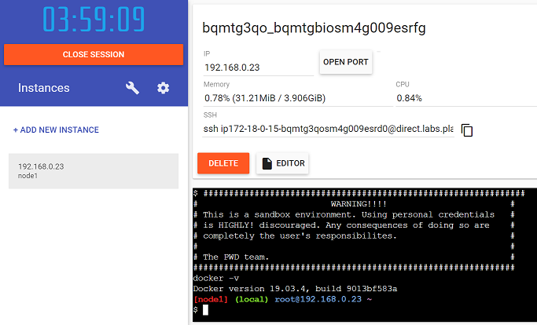
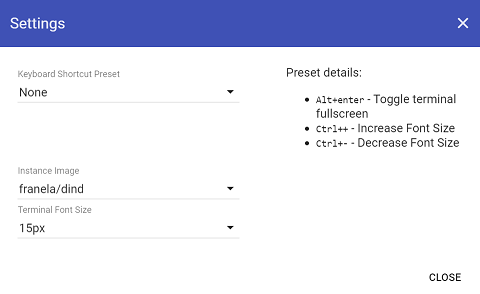

# Lezione 1 - Esercizio 1
 
> Scrivere, compilare ed eseguire il primo programma scritto in Java
> <br/>Pensare ad un semplice programma che stampa nella console un messaggio di benvenuto indicando l'età del linguaggio Java
> <br/>Eseguire il processo completo di scrittura del codice sorgente, produzione del bytecode ed esecuzione del programma cercando di capirne in modo chiaro il funzionamento, passaggio per passaggio

### Passaggi da eseguire:
1. Scrivere il codice sorgente del programma con un editor di testo e salvare il file **.java**
2. Utilizzare una JDK per compilare il programma Java tramite il comando `javac` per ottenere il file **.class**
3. Utilizzare una JDK per disassemblare il programma Java tramite il comando `javap` per visualizzare il bytecode del file **.class**
4. Utilizzare una JRE per eseguire il programma Java compilato (il file **.class**) tramite il comando `java` per ottenere l'output del programma in console
  
### NOTE: 
Verrà utilizzato per il test l’ambiente “sandbox” offerto dal play-with-docker (E’ richiesto un account su DockerHub).<br/>
La JDK e la JRE vengono recuperate da delle immagini Docker già pronte.

# Proposta di soluzione

1. Accedere al sito [Play With Docker][playwithdocker] utilizzando le proprie credenziali di [Docker Hub][dockerhub] <br/> <br/>

2. Creare una nuova istanza utilizzando il bottone `+ ADD NEW INSTANCE` <br/> <br/>

3. Avviare l'immagine Docker con OpenJDK eseguendo il comando `docker run -it groppedocker/centos-openjdk:jdk-8u242` <br/>
```console
Unable to find image 'groppedocker/centos-openjdk:jdk-8u242' locally
jdk-8u242: Pulling from groppedocker/centos-openjdk
f34b00c7da20: Pull complete 
5c74aaaaf526: Pull complete 
576b8541527c: Pull complete 
927da07760d2: Pull complete 
ec6e92cb5057: Pull complete 
c11c60358e5d: Pull complete 
455102eaaf9f: Pull complete 
Digest: sha256:819d40751652460eeac6eb55fa8eeea467289dd7f2b707da3d72e3b4cf9a0457
Status: Downloaded newer image for groppedocker/centos-openjdk:jdk-8u242
```
![Approfondimento][magnifying_glass_24] [Documentazione ufficiale][dockerdocs] di `Docker`<br/>

4. Opzionalmente utilizzando lo shortcut `ALT + ENTER` è possibile massimizzare la finestra della console <br/> <br/>


5. Verificare la corretta versione della JDK eseguendo il comando `java -version` <br/>
```console
openjdk version "1.8.0_242"
OpenJDK Runtime Environment (build 1.8.0_242-b08)
OpenJDK 64-Bit Server VM (build 25.242-b08, mixed mode)
```
6. Creare un nuovo file chiamato `HelloJava.java` utilizzando il comando `vi HelloJava.java` <br/>
7. Scrivere nel file il seguente codice sorgente Java, entrando in modalità `INSERT` premendo il tasto `i`, una volta terminata la scrittura del codice sorgente, digitare il comando `ESC + :x` per salvare il file. Per uscire senza salvare digitare invece il comando `ESC + :q!` <br/>
```java
public class HelloJava
{
	private static final int JAVA_YEAR_OF_BIRTH = 1995;
	
	public static void main(String[] args)
	{
		int currentYear = java.time.Year.now().getValue();
		int javaAge = currentYear - JAVA_YEAR_OF_BIRTH;
		
		System.out.println(String.format("Ciao, sono JAVA ed ho %d anni!", javaAge));
	}
}
```
![Approfondimento][magnifying_glass_24] [Documentazione][vimdocs] per l'editor di testo `VIM`<br/>

8. Eseguire il comando `file HelloJava.java`, per verificare la tipologia del file appena creato. E' possibile notare che il codice sorgente Java è un semplice file testuale <br/>
```console
HelloJava.java: C source, ASCII text
```
9. Compilare il codice sorgente Java utilizzando gli strumenti messi a disposizione dalla JDK, eseguire quindi il comando `javac HelloJava.java` per ottenere il file `HelloJava.class` composto da `bytecode` <br/>

10. Eseguire il comando `file HelloJava.class`, per verificare la tipologia del file appena creato. E' possibile notare che il file con estensione `.class` viene riconosciuto come file compilato per la versione `Java 1.8 (52.0)` <br/>
```console
HelloJava.class: compiled Java class data, version 52.0 (Java 1.8)
```
11. Utilizzare il `disassemblatore(disassembler)` che è uno strumento messo a disposizione dalla JDK per analizzare il `bytecode` prodotto e salvato nel file `.class`. Un `disassemblatore(disassembler)` differisce da un `decompilatore(decompiler)` perché opera a più basso livello. Per il linguaggio Java un `decompilatore` è in grado di covertire un file `.class` in un output leggibile a livello di codice sorgente, mentre un `disassemblatore` converte un file `.class` in un output leggibile a livello di `bytecode`
Eseguire quindi il comando `javap -c HelloJava.class` per poter visualizzare il seguente output in `bytecode` <br/>

```console
Compiled from "HelloJava.java"
public class HelloJava {
  public HelloJava();
    Code:
       0: aload_0
       1: invokespecial #1   // Method java/lang/Object."<init>":()V
       4: return

  public static void main(java.lang.String[]);
    Code:
       0: invokestatic  #2   // Method java/time/Year.now:()Ljava/time/Year;
       3: invokevirtual #3   // Method java/time/Year.getValue:()I
       6: istore_1
       7: iload_1
       8: sipush        1995
      11: isub
      12: istore_2
      13: getstatic     #5   // Field java/lang/System.out:Ljava/io/PrintStream;
      16: ldc           #6   // String Ciao, sono JAVA ed ho %d anni!
      18: iconst_1
      19: anewarray     #7   // class java/lang/Object
      22: dup
      23: iconst_0
      24: iload_2
      25: invokestatic  #8   // Method java/lang/Integer.valueOf:(I)Ljava/lang/Integer;
      28: aastore
      29: invokestatic  #9   // Method java/lang/String.format:(LString;[LObject;)LString;
      32: invokevirtual #10  // Method java/io/PrintStream.println:(Ljava/lang/String;)V
      35: return
}
* line 29 removed java/lang
```
![Approfondimento][magnifying_glass_24] [Elenco delle istruzioni][bytecodedocs] del `bytecode` <br/>
![Approfondimento][magnifying_glass_24] [Documentazione][javapdocs] `javap` <br/>
![Approfondimento][magnifying_glass_24] [Documentazone][jdktoolsdocs] completa per `JDK Tools and Utilities`

12. Eseguire il programma `HelloJava` digitando il comando `java HelloJava` ottenendo il seguente risultato a video <br/>

```console
Ciao, sono JAVA ed ho 25 anni!
```


### Riferimenti:

- [DockerHub][dockerhub]
- [Immagini Docker JDK e JRE][groppedockerjdk]
- [Play With Docker][playwithdocker]

<!-- Definizione dei link per le risorse esterne -->
[dockerhub]: <https://hub.docker.com/>
[groppedockerjdk]: <https://hub.docker.com/r/groppedocker/centos-openjdk>
[playwithdocker]: <https://labs.play-with-docker.com/>

***
[![Home][img_home]][href_home]
[![Lesson1][img_lesson]][href_lesson]

<!-- Definizione dei link per la navigazione -->
[img_home]: <http://files.softicons.com/download/toolbar-icons/soft-icons-by-lokas-software/png/48x48/0007-home.png>
[href_home]: <https://groppedev.github.io/java-getting-started/>
[img_lesson]: <http://files.softicons.com/download/toolbar-icons/ravenna-3d-icons-by-double-j-design/png/48x48/Books.png>
[href_lesson]: <../>
[img_lesson]: <http://files.softicons.com/download/toolbar-icons/ravenna-3d-icons-by-double-j-design/png/48x48/Books.png>
[magnifying_glass_48]: <http://files.softicons.com/download/toolbar-icons/vista-base-software-icons-2-by-icons-land/png/48x48/Magnifier2.png>
[magnifying_glass_32]: <http://files.softicons.com/download/toolbar-icons/vista-base-software-icons-2-by-icons-land/png/32x32/Magnifier2.png>
[magnifying_glass_24]: <http://files.softicons.com/download/toolbar-icons/vista-base-software-icons-2-by-icons-land/png/24x24/Magnifier2.png>
[duke_cheers]: <http://cr.openjdk.java.net/~jeff/Duke/png/DukeCheers.png>

<!-- Definizione dei link -->
[dockerhub]: <https://hub.docker.com/>
[dockerdocs]: <https://docs.docker.com/get-started/>
[groppedockerjdk]: <https://hub.docker.com/r/groppedocker/centos-openjdk>
[playwithdocker]: <https://labs.play-with-docker.com/>
[vimdocs]: <https://vimhelp.org/usr_toc.txt.html>
[bytecodedocs]: <https://docs.oracle.com/javase/specs/jvms/se8/html/jvms-6.html#jvms-6.5>
[javapdocs]: <https://docs.oracle.com/javase/8/docs/technotes/tools/unix/javap.html>
[jdktoolsdocs]: <https://docs.oracle.com/javase/8/docs/technotes/tools/#troubleshoot>

<!-- Tabella commentata -->
<!--| First Header  | Second Header |-->
<!--| ------------- | ------------- |-->
<!--| Content Cell  | Content Cell  |-->
<!--| Content Cell  | Content Cell  |-->
