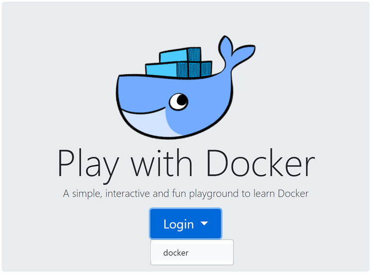

# Lezione 1 - Esercizio 1
 
> Scrivere, compilare ed eseguire un semplice programma Java
> <br/>Pensare ad un semplice programma che stampa nella console il messaggio: “Hello Java”
> <br/>Eseguire il processo completo di scrittura del codice sorgente, produzione del bytecode ed esecuzione del programma

### Passaggi da eseguire:
1. Scrivere il codice sorgente del programma con un editor di testo e salvare il file **.java**
2. Utilizzare una JDK per compilare il programma Java tramite il comando `javac` per ottenere il file **.class**
3. Utilizzare una JDK per disassemblare il programma Java tramite il comando `javap` per visualizzare il bytecode del file **.class**
4. Utilizzare una JRE per eseguire il programma Java compilato (il file **.class**) tramite il comando `java` per ottenere l'output del programma in console
  
### NOTE: 
Verrà utilizzato per il test l’ambiente “sandbox” offerto dal play-with-docker (E’ richiesto un account su DockerHub).<br/>
La JDK e la JRE vengono recuperate da delle immagini Docker già pronte.

# Proposta di soluzione

1. Accedere al sito https://labs.play-with-docker.com/ utilizzando le proprie credenziali GitHub

2. Creare una nuova istanza utilizzando il bottone `+ ADD NEW INSTANCE`
3. Avviare l'immagine Docker con OpenJDK eseguendo il comando `docker run -it groppedocker/centos-openjdk:jdk-8u242`
```console
Unable to find image 'groppedocker/centos-openjdk:jdk-8u242' locally
jdk-8u242: Pulling from groppedocker/centos-openjdk
f34b00c7da20: Pull complete 
5c74aaaaf526: Pull complete 
576b8541527c: Pull complete 
927da07760d2: Pull complete 
ec6e92cb5057: Pull complete 
c11c60358e5d: Pull complete 
455102eaaf9f: Pull complete 
Digest: sha256:819d40751652460eeac6eb55fa8eeea467289dd7f2b707da3d72e3b4cf9a0457
Status: Downloaded newer image for groppedocker/centos-openjdk:jdk-8u242
```
4. Opzionalmente utilizzando lo shortcut `ALT + ENTER` è possibile massimizzare la finestra della console
5. Verificare la corretta versione della JDK eseguendo il comando `java -version`
```console
openjdk version "1.8.0_242"
OpenJDK Runtime Environment (build 1.8.0_242-b08)
OpenJDK 64-Bit Server VM (build 25.242-b08, mixed mode)
```
6. Creare 
```java
public class HelloJava
{
  public static void main(String[] args)
  {
    System.out.println("Hello Java!");
  }
}
```

### Riferimenti:

- [DockerHub][dockerhub]
- [Immagini Docker JDK e JRE][groppedockerjdk]
- [Play With Docker][playwithdocker]

<!-- Definizione dei link per le risorse esterne -->
[dockerhub]: <https://hub.docker.com/>
[groppedockerjdk]: <https://hub.docker.com/r/groppedocker/centos-openjdk>
[playwithdocker]: <https://labs.play-with-docker.com/>

***
[![Home][img_home]][href_home]
[![Lesson1][img_lesson]][href_lesson]

<!-- Definizione dei link per la navigazione -->
[img_home]: <http://files.softicons.com/download/toolbar-icons/soft-icons-by-lokas-software/png/48x48/0007-home.png>
[href_home]: <https://groppedev.github.io/java-getting-started/>
[img_lesson]: <http://files.softicons.com/download/toolbar-icons/ravenna-3d-icons-by-double-j-design/png/48x48/Books.png>
[href_lesson]: <../>

<!-- Definizione dei link -->
[dockerhub]: <https://hub.docker.com/>
[groppedockerjdk]: <https://hub.docker.com/r/groppedocker/centos-openjdk>
[playwithdocker]: <https://labs.play-with-docker.com/>
<!-- Tabella commentata -->
<!--| First Header  | Second Header |-->
<!--| ------------- | ------------- |-->
<!--| Content Cell  | Content Cell  |-->
<!--| Content Cell  | Content Cell  |-->
