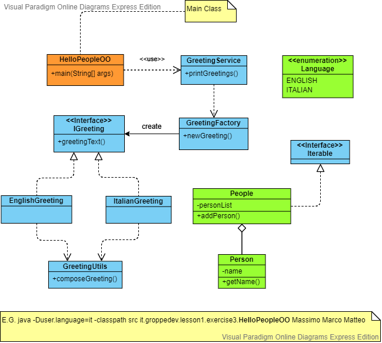

# Lezione 1 - Esercizio 3

***
[![Home][img_home]][href_home]
[![Lesson1][img_lesson]][href_lesson]

<!-- Definizione dei link per la navigazione -->
[img_home]: <http://files.softicons.com/download/toolbar-icons/soft-icons-by-lokas-software/png/48x48/0007-home.png>
[href_home]: <https://groppedev.github.io/java-getting-started/>
[img_lesson]: <http://files.softicons.com/download/toolbar-icons/ravenna-3d-icons-by-double-j-design/png/48x48/Books.png>
[href_lesson]: <../>
