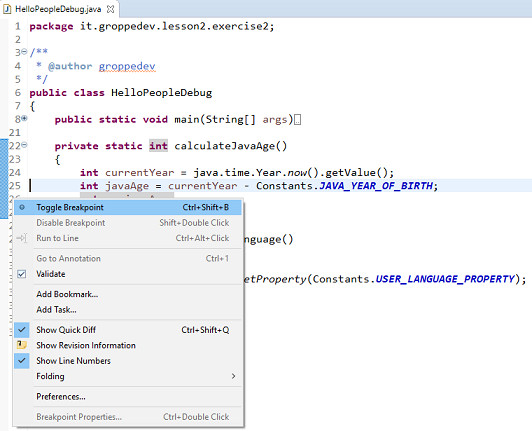
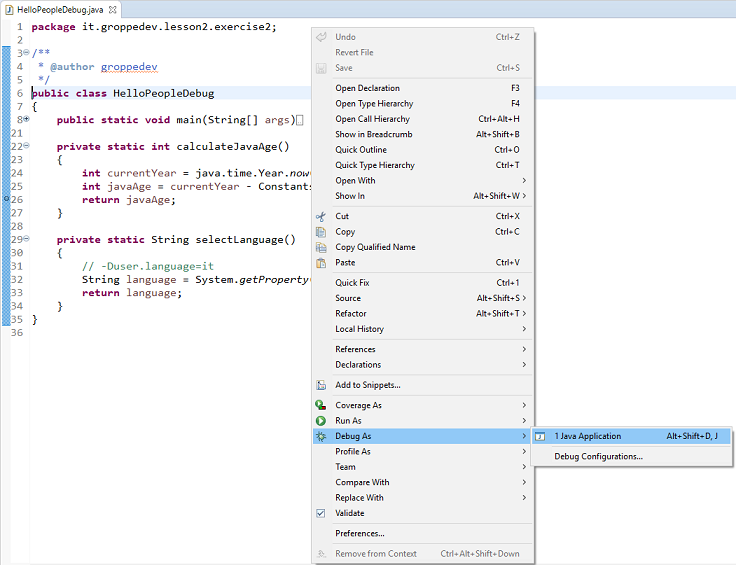

# Lezione 2 - Esercizio 2

> Utilizzare Eclipse per esercitarsi con la funzione di DEBUG allo scopo di analizzare l'anatomia di un programma Java.
> Per rendere più completo l'esercizio è stata introdotta una classe di utilità Printer per differenziare la stampa del saluto nella console

### Passaggi da eseguire:
1. Aggiungere un _breakpoint_ alla linea 24 nel metodo `HelloPeopleDebug#calculateJavaAge`. In questo passaggio analizzare la sezione `Variables` ed il `return value`.
2.  Aggiungere un _breakpoint_ alla linea 13 nel metodo `Printer#printSynch`. In questo passaggio analizzare la sezione `Call Stack`.


# Proposta di soluzione

### Guide complete sul Debug con Eclipse IDE

- [Debug con Eclipse - Vogella][tutorialdebugvogella] 
- [Debug con Eclipse - Jaxenter][tutorialdebugjaxenter]

### Aggiungere un Breakpoint
Per aggiungere un _breakpoint_ ci si deve spostare sulla linea di codice di interesse ed utilizzare lo  _shortcut_ `CTRL+SHIFT+B`. In alternativa, tasto destro sul numero di linea e click sull'opzione `Toggle Breakpoint` <br/><br/>
 <br/>

### Esecuzione in modalità Debug
Per avviare un programma in modalità _Debug_ da Eclipse, tasto destro sul codice sorgente poi `Debug As -> Java Application` <br/><br/>
 <br/>

### Comandi per il Debug

Comando | Descrizione
------------ | -------------
`F5` | `Step Into` Esegue l'istruzione successiva e in caso di un metodo entra in quest'ultimo
`F6` | `Step Over` Esegue l'istruzione successiva ma in caso di metodo non entra in quest'ultimo 
`F7` | `Step Return` Restituisce il controllo al metodo chiamante del metodo corrente
`F8` | `Resume` Forza la prosecuzione dell'esecuzione fino al successivo _Breakpoint_ o _Watchpoint_

2. Sezione `Variables` ed il `return value

```java
public class HelloPeople
{
	private static final String USER_LANGUAGE_PROPERTY = "user.language";
	private static final String ITALIAN_ALIAS = "it";
	
	private static final String ENGLISH_TXT = "Hello %s, I am JAVA and I am %d years old!";
	private static final String ITALIAN_TXT = "Ciao %s, sono JAVA ed ho %d anni!";
	
	private static final int JAVA_YEAR_OF_BIRTH = 1995;

	public static void main(String[] args)
	{
		int currentYear = java.time.Year.now().getValue();
		int javaAge = currentYear - JAVA_YEAR_OF_BIRTH;
		// -Duser.language=it
		String language = System.getProperty(USER_LANGUAGE_PROPERTY);

		// Massimo Marco Matteo
		for(String person : args)
		{
			if(language.equals(ITALIAN_ALIAS))
			{
				System.out.println(String.format(ITALIAN_TXT, person, javaAge));
			}
			else
			{
				System.out.println(String.format(ENGLISH_TXT, person, javaAge));
			}
		}
	}
}
```

2. Codice dopo il refactor della main class `HelloPeopleDebug`

```java
public class HelloPeopleDebug
{
	public static void main(String[] args)
	{
		int javaAge = calculateJavaAge();
		String language = selectLanguage();

		// Massimo Marco Matteo
		for(String person : args)
		{
			Greeting greeting = new Greeting(javaAge, language, person);
			greeting.print();
		}
	}

	private static int calculateJavaAge()
	{
		int currentYear = java.time.Year.now().getValue();
		int javaAge = currentYear - Constants.JAVA_YEAR_OF_BIRTH;
		return javaAge;
	}

	private static String selectLanguage()
	{
		// -Duser.language=it
		String language = System.getProperty(Constants.USER_LANGUAGE_PROPERTY);
		return language;
	}
}
```

3. Codice dopo il refactor della classe `Constants`

```java
public class Constants
{
	static final String USER_LANGUAGE_PROPERTY = "user.language";
	static final String ITALIAN_ALIAS = "it";
	static final String ENGLISH_TXT = "Hello %s, I am JAVA and I am %d years old!";
	static final String ITALIAN_TXT = "Ciao %s, sono JAVA ed ho %d anni!";
	static final int JAVA_YEAR_OF_BIRTH = 1995;
}
```

4. Codice dopo il refactor della classe `Greeting`

```java
public class Greeting
{
	private final int javaAge;
	private final String language;
	private final String person;

	public Greeting(int javaAge, String language, String person)
	{
		this.javaAge = javaAge;
		this.language = language;
		this.person = person;
	}

	public int getJavaAge()
	{
		return javaAge;
	}

	public String getLanguage()
	{
		return language;
	}

	public String getPerson()
	{
		return person;
	}
	
	public void print()
	{
		if(this.getLanguage().equals(Constants.ITALIAN_ALIAS))
		{
			printMessage(this.getJavaAge(), this.getPerson(), Constants.ITALIAN_TXT);
		}
		else
		{
			printMessage(this.getJavaAge(), this.getPerson(), Constants.ENGLISH_TXT);
		}
	}
	
	private static void printMessage(int javaAge, String person, String message)
	{
		System.out.println(String.format(message, person, javaAge));
	}

	@Override
	public int hashCode()
	{
		final int prime = 31;
		int result = 1;
		result = prime * result + javaAge;
		result = prime * result + ((language == null) ? 0 : language.hashCode());
		result = prime * result + ((person == null) ? 0 : person.hashCode());
		return result;
	}

	@Override
	public boolean equals(Object obj)
	{
		if (this == obj)
			return true;
		if (obj == null)
			return false;
		if (getClass() != obj.getClass())
			return false;
		Greeting other = (Greeting) obj;
		if (javaAge != other.javaAge)
			return false;
		if (language == null)
		{
			if (other.language != null)
				return false;
		} else if (!language.equals(other.language))
			return false;
		if (person == null)
		{
			if (other.person != null)
				return false;
		} else if (!person.equals(other.person))
			return false;
		return true;
	}

	@Override
	public String toString()
	{
		return "Greeting [javaAge=" + javaAge + ", language=" + language + ", person=" + person + "]";
	}
}
```


[tutorialdebugjaxenter]: <https://jaxenter.com/debugging-eclipse-ide-java-devs-135362.html>
[tutorialdebugvogella]: <https://www.vogella.com/tutorials/EclipseDebugging/article.html>
