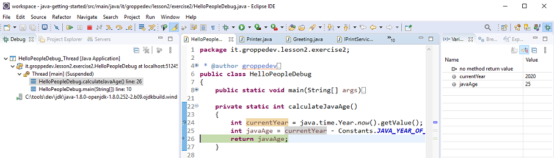
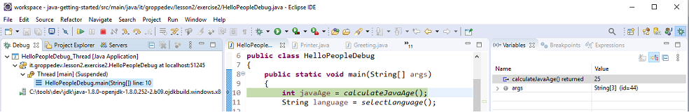
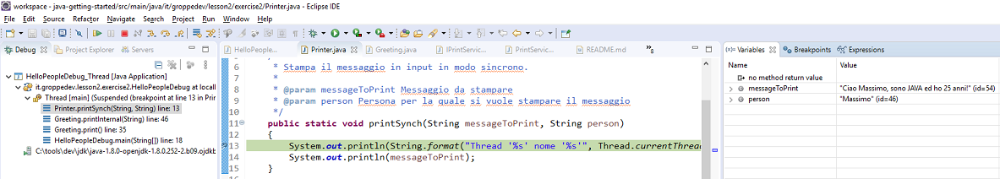
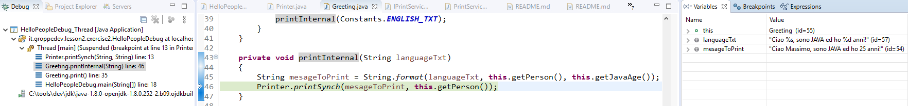
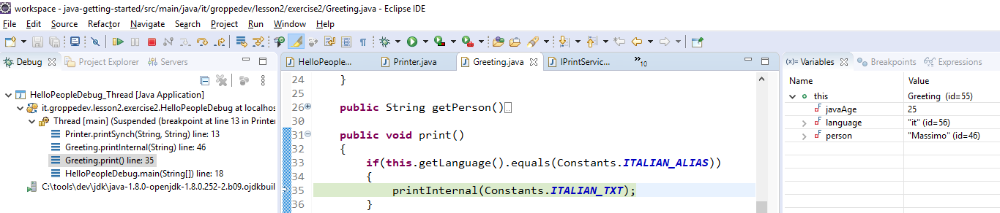
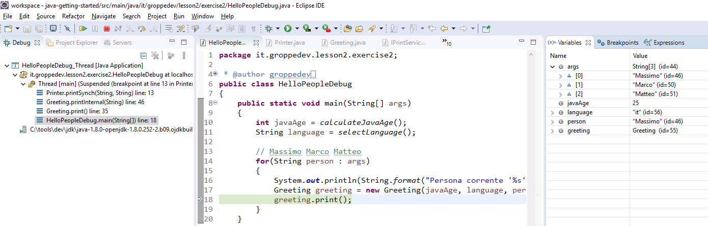
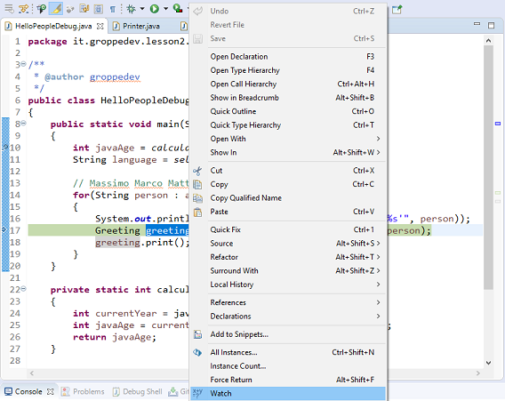
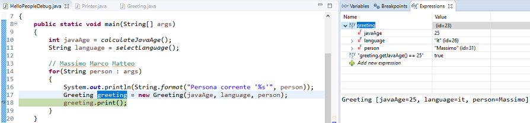
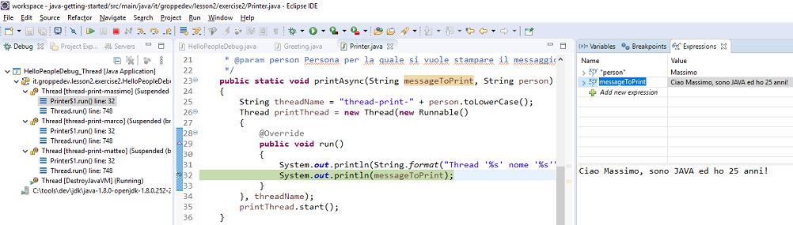

# Lezione 2 - Esercizio 2

> Utilizzare Eclipse per esercitarsi con la funzione di DEBUG allo scopo di analizzare l'anatomia di un programma Java.
> Per rendere più completo l'esercizio è stata introdotta una classe di utilità Printer per differenziare la stampa del saluto nella console

```java
public class Printer
{
	/**
	 * Stampa il messaggio in input in modo sincrono.
	 * 
	 * @param messageToPrint Messaggio da stampare
	 * @param person Persona per la quale si vuole stampare il messaggio
	 */
	public static void printSynch(String messageToPrint, String person)
	{
		System.out.println(String.format("Thread '%s' nome '%s'", 
					         Thread.currentThread().getName(), person));
		System.out.println(messageToPrint);
	}
	
	/**
	 * Stampa il messaggio in input in modo asincrono creando un nuovo Thread.
	 * 
	 * @param messageToPrint Messaggio da stampare
	 * @param person Persona per la quale si vuole stampare il messaggio
	 */
	public static void printAsync(String messageToPrint, String person)
	{
		String threadName = "thread-print-" + person.toLowerCase();
		Thread printThread = new Thread(new Runnable()
		{
			@Override
			public void run()
			{
				System.out.println(String.format("Thread '%s' nome '%s'", 
								 Thread.currentThread().getName(), person));
				System.out.println(messageToPrint);
			}
		}, threadName);
		printThread.start();
	}
	
	/**
	 * Stampa il messaggio in input in modo asincrono creando un nuovo Thread ma sfruttando la sintassi delle Lambda Expression.
	 * 
	 * @param messageToPrint Messaggio da stampare
	 * @param person Persona per la quale si vuole stampare il messaggio
	 */
	public static void printAsyncLambda(String messageToPrint, String person)
	{
		String threadName = "thread-print-" + person.toLowerCase();
		Thread printThread = new Thread(() -> {
					System.out.println(String.format("Thread '%s' nome '%s'", 
								  	 Thread.currentThread().getName(), person));
					System.out.println(messageToPrint);
		}, threadName);
		printThread.start();
	}
}
```

### Passaggi da eseguire:
1. Aggiungere un _breakpoint_ alla linea 24 nel metodo `HelloPeopleDebug#calculateJavaAge`. In questo passaggio analizzare la sezione `Variables` ed il `return value`.
2.  Aggiungere un _breakpoint_ alla linea 13 nel metodo `Printer#printSynch`. In questo passaggio analizzare la sezione `Call Stack`.
3.  Aggiungere un _breakpoint_ alla linea 18 nel metodo `HelloPeopleDebug#main`. Successivamente aggiungere una `Expression` utilizzando il comando `watch` (Selezione variabile _greeting_ alla linea 17 tasto desto e poi watch). In questo passaggio analizzare la sezione `Expressions`.
4. Nel metodo `Greeting#printInternal` sostituire il richiamo al metodo `Printer#printSynch` con il richiamo al metodo `Printer#printAsync`. Successivamente aggiungere un _breakpoint_ alla linea 32 del metodo `Printer#printAsync` ed avviare il _Debug_. In questo passaggio prestare attenzione alla sezione _Call Stack_ ed alla presenza di molteplici _Thread_

# Tutorial minimale sul Debug

### Aggiungere un Breakpoint
Per aggiungere un _breakpoint_ ci si deve spostare sulla linea di codice di interesse ed utilizzare lo  _shortcut_ `CTRL+SHIFT+B`. In alternativa, tasto destro sul numero di linea e click sull'opzione `Toggle Breakpoint` <br/><br/>
 <br/>

### Esecuzione in modalità Debug
Per avviare un programma in modalità _Debug_ da Eclipse, tasto destro sul codice sorgente poi `Debug As -> Java Application` <br/><br/>
 <br/>

### Comandi per il Debug

Comando | Descrizione
------------ | -------------
`F5` | `Step Into` Esegue l'istruzione successiva e in caso di un metodo entra in quest'ultimo
`F6` | `Step Over` Esegue l'istruzione successiva ma in caso di metodo non entra in quest'ultimo 
`F7` | `Step Return` Restituisce il controllo al metodo chiamante del metodo corrente
`F8` | `Resume` Forza la prosecuzione dell'esecuzione fino al successivo _Breakpoint_ o _Watchpoint_

### Guide complete sul Debug con Eclipse IDE

- [Debug con Eclipse - Vogella][tutorialdebugvogella] 
- [Debug con Eclipse - Jaxenter][tutorialdebugjaxenter]

# Proposta di soluzione

## Sezione Variables ed il return value <br/>
 <br/>
 <br/>

## Sezione Call Stack <br/>

Frame | Line
------------ | -------------
`Printer.printSynch(String, String)` | _line: 14_
`Greeting.printInternal(String)` | _line: 46_
`Greeting.print()` | _line: 35_
`HelloPeopleDebug.main(String[])` | _line: 18_

Thread in esecuzione: `Thread [main] (Suspended (breakpoint at line 14 in Printer))`

```java Printer.printSynch(String, String) ``` 
 <br/>
```java Greeting.printInternal(String) ```
 <br/>
```java Greeting.print() ```
 <br/>
```java HelloPeopleDebug.main(String[]) ```
 <br/>

## Sezione Expressions <br/>

 <br/><br/>
Il metodo `Greeting#toString()` permette la seguente visualizzazione nella sezione `Expressions`
 <br/>

## Sezione Call Stack Multithreading <br/>

 <br/><br/>

***

[![Home][img_home]][href_home]
[![Lesson2][img_lesson]][href_lesson]

<!-- Definizione dei link per la navigazione -->
[img_home]: <../../../../../resources/images/navigation/home.png>
[href_home]: <https://groppedev.github.io/java-getting-started/>
[img_lesson]: <../../../../../resources/images/navigation/books.png>
[href_lesson]: <../>
[magnifying_glass_24]: <../../../../../resources/images/navigation/magnifier.png>


[tutorialdebugjaxenter]: <https://jaxenter.com/debugging-eclipse-ide-java-devs-135362.html>
[tutorialdebugvogella]: <https://www.vogella.com/tutorials/EclipseDebugging/article.html>
